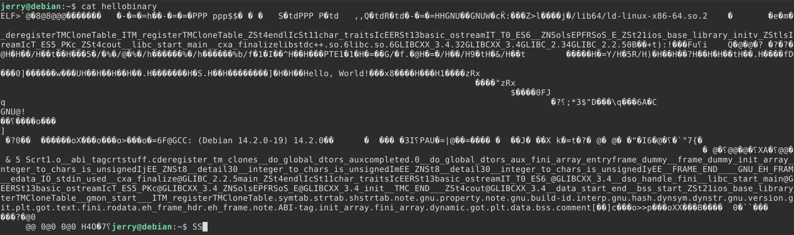
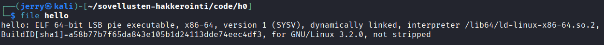

# H0 - Compile and Analyze

## a)

- Ensin tein **C++** kielellä simppelin Hello World ohjelman

```c++
// hello.cpp

#include <iostream>

int main() {
    std::cout << "Hello World!";
    return 0;
}
```

- Sitten käänsin c++ ohjelman g++ kääntäjällä suoritettavaksi binääritiedostoksi nimeltä **hello**

```bash
$ g++ hello.cpp -o hello
```

- Tarkistin, että ohjelma toimii ajamalla sen

```bash
$ ./hello
Hello World!
```

- Seuraavaksi tarkastelin **hello** tiedostoa cat komennolla, mutta tulostus oli muodossa, jota on vaikea tutkia



- Muutin tiedoston **HEX** muotoon, jotta sitä olisi helpompi tarkastella



## Lähteet

- [terokarvinen.com](terokarvinen.com)
- [C++ "Hello, World!" Program](https://www.programiz.com/cpp-programming/examples/print-sentence)
