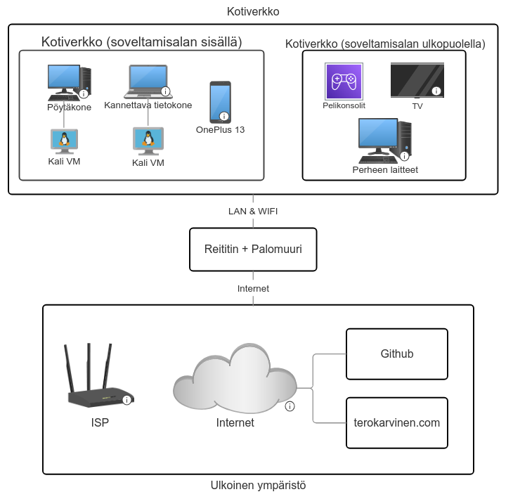

# H1 - Freedom of Action, Control, and Risk Mitigation

## a1) Mitä soveltamisalaan kuuluu?

- Perusinfrastruktuuri:
  - Kotiverkkoni soveltamisalaan kuuluu **reititin**, **Wi-Fi** ja **palomuuri**
- Kurssiharjoituksiin käytettävät laitteet:
  - **Kannettava tietokone**, jota käytän lähinnä tuntien aikana tehtäviin
  - **Pöytätietokone**, jota käytän läksyjen tekemiseen kotona
  - Kaksi **Kali Linux -virtuaalikonetta** VirtualBox-ohjelmassa, jotka sijaitsevat kannettavalla ja pöytätietokoneellani
  - OnePlus 13 puhelin monivaiheista tunnistautumista varten
- Tieto ja data:
  - Kurssimateriaalit (terokarvinen.com)
  - Omat muistiinpanot (obsidian)
  - Github repositoriot

## a2) Mitä soveltamisalan ulkopuolelle jätetään ja miksi?

- Playstation 4 ja Nintendo Switch pelikonsolit
- Älytelevisio
- ISP verkko reitittimen internet-puolella
- 2 kannettavaa tietokonetta ja 2 pöytäkonetta, jotka kuuluvat perheenjäsenilleni
- 3 puhelinta, jotka kuuluvat perheenjäsenilleni

- Älytelevisio ja perheenjäsenten laitteet jäävät soveltamisalan ulkopuolelle, sillä niillä ei ole mitään tekemistä tämän kurssin kanssa. ISP:n verkko reitittimen internet-puolella jää soveltamisalan ulkopuolelle, sillä en voi itse säätää sitä millään tavalla toisin kuin kotiverkkoni, jota voin hallita.

## a3) Keskeiset rajapinnat ja rajat

- **Internet**: kotireititin ja palomuuri luovat rajan kotiverkon ja ulkopuolisen internetin välille
- **Pilvipalvelut**: käytän GitHubia kurssitehtävien säilyttämiseen, versionhallintaan ja tiedostojen siirtämiseen virtuaalikoneideni välillä
- **Palveluntarjoaja**: ISP muodostaa ulkoisen ympäristön

## Verkko- ja rajapintakaavio

## Mitä todisteita voisin antaa?

- **Reititin**: kuvakaappaus reitittimen asetussivuista, jossa näkyy wifi ja palomuuriasetukset
- **Tietokoneet ja puhelin**: laiteinventaario ja kuvankaappaus verkkoon liitetyistä laitteista
- **Tieto ja data**: kuvankaappaus omista muistiinpanoistani ja Github repositoriostani

## b) Tehtävän yhdistäminen standardiin

| **Sidosryhmä** | **Tarve tai vaatimus** | **ISO 27001 -viittaus** | **Miten vaatimustenmukaisuus osoitetaan** |
| ------------- | ------------- | ------------- | ------------- |
| Minä itse | Kurssitehtävien tekeminen, sekä niiden säilyttäminen | Planning – 6.1 Actions to address risks and opportunities | Suojaamalla kurssin tiedostot ja tekemällä varmuuskopioita. Fyysiset laitteet suojattu vahvoilla salasanoilla ja monivaiheisella tunnistautumisella |
| Oppilaitos | Akateeminen rehellisyys ja varmistus, että verkossa ei tehdä mitään haitallista| Context – 4.2 Understanding the needs and expectations of interested parties | Vahvat salasanat ja monivaiheinen tunnistautuminen koulun tileillä ja kurssin sääntöjen noudattaminen |
| Perheenjäsenet | Varmuus siitä, että kurssin toiminta ei vaikuta jokapäiväiseen elämään | Operation - 8.1 Operational planning and control | Varmistus, että perheenjäsenten tietoja tai laitteita ei käytetä kurssiin liittyvissä tehtävissä |

## Lähteet
- [terokarvinen.com](terokarvinen.com)
- [Clause-by-clause explanation of ISO 27001](https://info.advisera.com/free-downloads/ISO_27001/Clause_by_clause_explanation_of_ISO_27001_EN.pdf)
- [Smartdraw - Online Network Diagram Tool](https://www.smartdraw.com/network-diagram/network-diagram-software.htm)
- Tekoälyä käytetty englannista suomeksi kääntämiseen ja kirjoitusvirheiden löytämiseen

