# H2 - Break & Unbreak

## Tiivistelmät

### OWASP

- Kulunvalvonta varmistaa, että käyttäjät pääsevät käsiksi vain asioihin, joihin heillä on oikeus.
  - Jos käyttäjä toimii oikeuksiensa ulkopuolella, syntyy riskejä datan tuhoutumiselle, salaisen tiedon paljastumiselle tai datan muuttumiselle.
- Tällaiset riskit voidaan ennaltaehkäistä noudattamalla erilaisia kulunvalvontakeinoja.
  - Esimerkiksi pääsy tietoihin voidaan oletuksena aina estää ja lokit pitää ajan tasalla.

### Find Hidden Web Directories – Fuzz URLs with ffuf

- Servereillä on piilotettuja hakemistoja, joihin pääsee käyttämällä tiettyjä polkuja. Näitä polkuja voi löytää käyttämällä ffuf-ohjelmaa.
- ffuf käyttää käyttäjän valitsemaa sanalistaa ja kokeilee jokaista vaihtoehtoa URL-osoitteessa löytääkseen piilotettuja polkuja.
- ffuf voi myös suodattaa tuloksia esimerkiksi koon tai rivimäärän mukaan, jos tuloksia on paljon.

### Access Control Vulnerabilities and Privilege Escalation

- Kulunvalvonta rajoittaa käyttäjien pääsyä tiettyihin tiedostoihin sekä oikeutta suorittaa muutoksia.
  - Tämä varmistetaan tunnistautumisella, lokitietojen avulla ja määrittämällä käyttäjille asianmukaiset oikeudet.
- Viallinen kulunvalvonta johtaa siihen, että käyttäjä pääsee käsiksi johonkin, johon hänellä ei ole oikeutta.

### Raportin kirjoittaminen

- Raportissa kerrotaan tarkasti, mitä on tehty ja mitä tapahtui.
- Raportissa on hyvä selittää myös käytetty ympäristö, sillä se voi vaikuttaa tuloksiin.
  - Esimerkiksi millä koneella testit on tehty.
- Väliotsikoiden käyttö ja hyvä kieli ovat myös tärkeitä, jotta raportti pysyy selkeänä.
- On tärkeää mainita myös lähteet raportissa, jotta lukija tietää, mikä tieto on kirjoittajan omaa ajatusta ja mikä on peräisin lähteistä.

## a) Break into 010-staff-only

- Ensimmäisenä latasin tarvittavat ohjelmat ja tiedostot ja ajoin python koodin

```bash
$ wget https://terokarvinen.com/hack-n-fix/teros-challenges.zip
$ unzip teros-challenges.zip
$ sudo apt install wget unzip python3-flask python3-flask-sqlalchemy
```

```bash
$ cd challenges/010-staff-only/
$ python3 staff-only.py
```

- Pääsin nettisivulla ja aloin kokeilla erilaisia menetelmiä
  - Ensin kokeilin url-osoitteen perään eri päätteitä kuten **admin**, **SUPERADMIN**, etc. Nämä eivät johtaneet mihinkään
  - Kokeilin seuraavaksi muokata PIN-kenttää eri tavoilla kirjoittamalla esimerkiksi value kenttään admin. Tämä ei myöskään johtanut mihinkään
- Käännyin tehtävän vihjeiden puoleen ja tajusin, että input kentän voi muuttaa sellaiseksi, että siihen voi myös kirjoittaa tekstiä
  - Tämän jälkeen kokeilin erilaisia vaihtoehtoja jälleen kohtaan **value=""**
    - Kokeilin esimerkiksi **"SELECT * FROM pins"**, mutta se ei toiminut
    - Ainoa vaihtoehto, josta tuli mitään oli **"'OR 1=1"**, josta tuli vain salasana foo ja olin taas umpikujassa

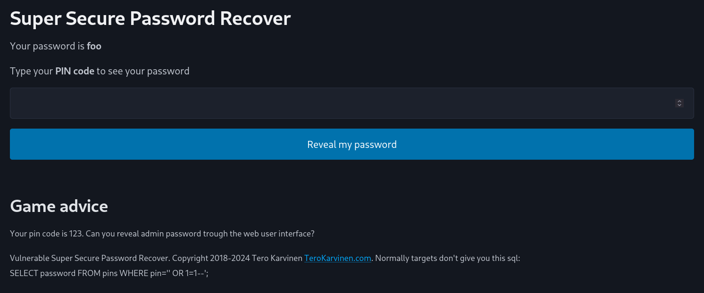

- Tuntui, että en pääse mihinkään joten käännyin ohjeiden walkthrough osioon ja luin Robinin menetelmän
- Huomasin, että olin oikein vaihtanut input kenttää, mutta SQL on minulle sen verran vieras, että en vain tiettyt oikeaa koodipätkää
- Kokeilin Robinin koodia ja se tosiaan toimi

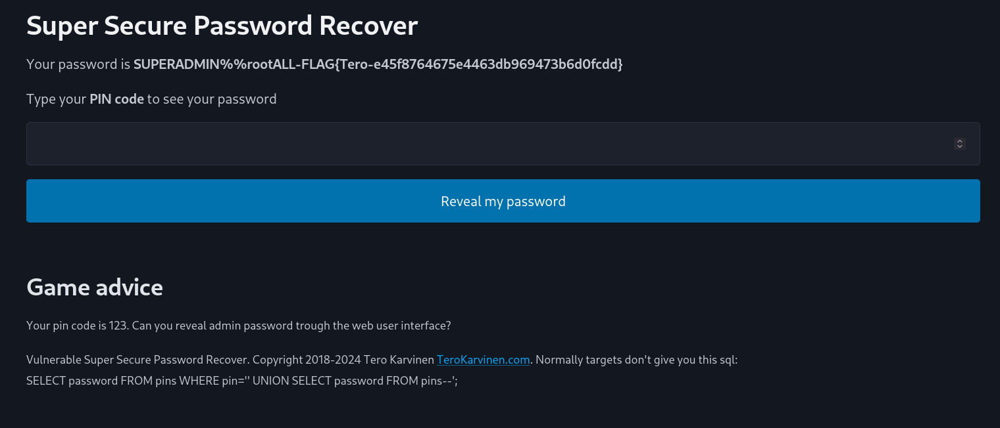

## b) Fix the 010-staff-only vulnerability

- Tutkin sivun lähdekoodia ja ajattelin, että jotenkin täytyy estää käyttäjä ajamasta SQL koodia
- Löysin koodista alueen, jossa käsitellään salasanan näyttämistä PIN-koodeista, mutta vajaalla Python osaamisellani olin hämilläni mitä tulisi muuttaa

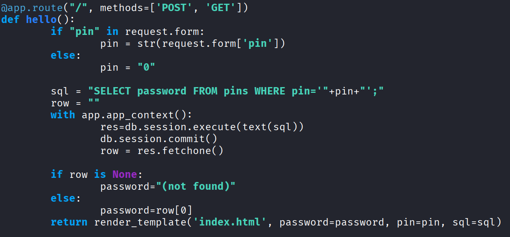

- Käännyin jälleen Robinin vihjeiden pariin ja olin ilmeisesti ainakin tutkinut oikeaa osaa koodista, mutta taitoni loppuivat siihen
- Kokeilin Robinin esimerkin mukaista koodia ja se esti aiemmin kokeillun hyökkäyksen ja antoi salasanaksi vain **(not found)**

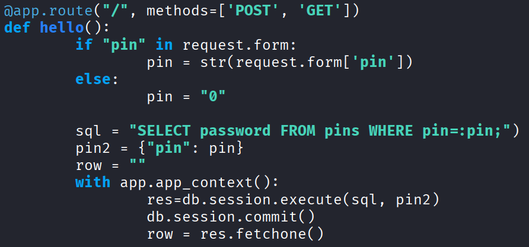
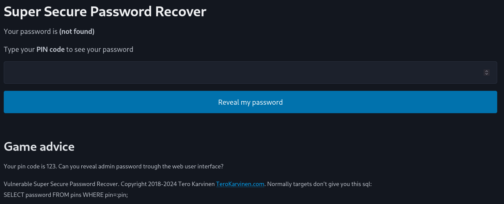

## c) Solve dirfuzt-1

- Latasin **dirfuzt-1** ohjelman ja ajoin sen saadakseni nettisivun osoitteen

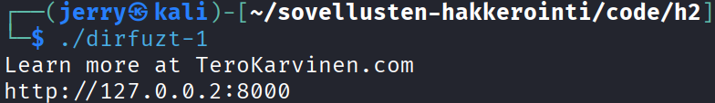

- Sitten latasin **ffuf** ohjelman ja ohjeissa mainitun **Seclistan**

```bash
$ sudo apt-get update
$ sudo apt-get install ffuf
$ wget https://raw.githubusercontent.com/danielmiessler/SecLists/master/Discovery/Web-Content/common.txt
```

- Ensimmäisenä ajoin ffuf ohjelman ilman mitään suodattimia ja käyttäen seclistaa **common.txt**
- Ohjelma suoriutui oikein ja sain vastauksia, mutta niitä oli lukematon määrä ja lähes kaikki näytti **status:200** eli ok

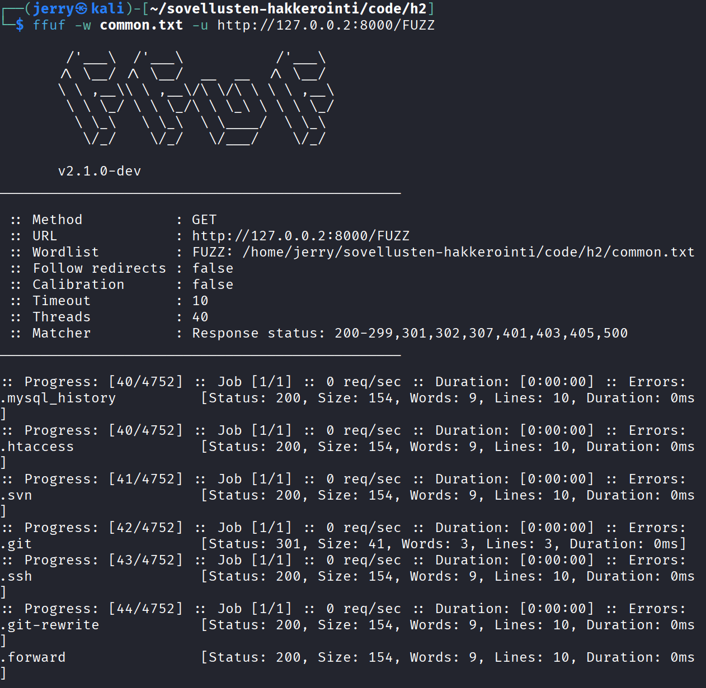

- Tuloksesta huomasin kuitenkin, että suurin osa tuloksista oli 10 riviä pitkiä, joten lisäsin suodattimen **"-fl 10"**, joka suodattaa kaikki 10 rivin vastaukset pois

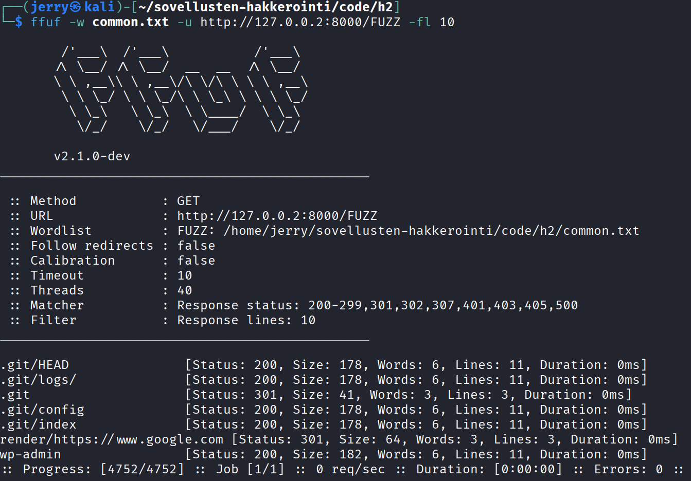

- Tällä kertaa vastaukseksi tuli vain seitsemän vaihtoehtoa
- Muistin, että tehtävä oli löytää **admin sivu** sekä **versionhallinta sivu**
  - Päätin ensin etsiä admin sivun ja vastauksissa oli vaihtoehto **wp-admin**, joten kokeilin sitä ja se olikin oikea reitti

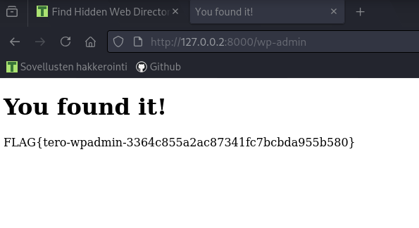

- Seuraavaksi olisi aika löytää versionhallinta sivu, joten kokeilin vastausta **".git"**, koska tiedän Gitin olevan versionhallintaohjelma. Tämäkin johti oikeaan paikkaan

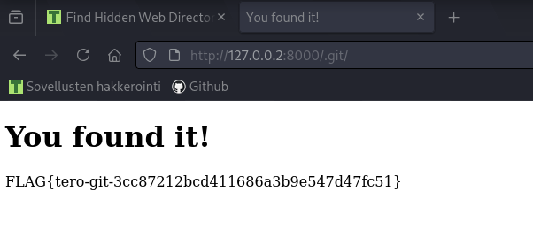

## d) Break into 020-your-eyes-only

- Ensimmäisenä loin tehtävälle virtuaalisen ympäristön ohjeiden mukaisesti

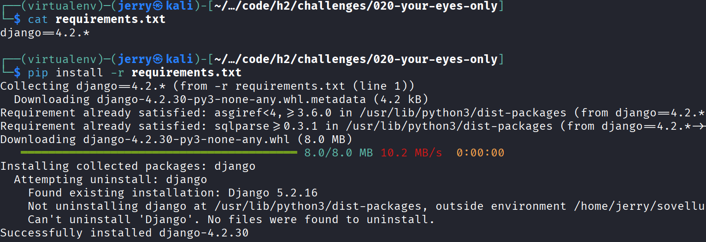

- Tämän jälkeen menin selaimella sivulle ja aloin tutkimaan eri vaihtoehtoja
  - Kokeilin kirjoittaa kirjautumiskenttään käyttäjänimeksi ja salasanaksi **admin**, mutta yllättäen se ei toiminut
  - Tämän jälkeen loin uuden käyttäjän ja yritin painaa admin dashboard nappia, mutta minulla ei ollut oikeuksia ja sain vain koodin **"403 forbidden"**
- Sitten päätin yrittää edellisen tehtävät ffuf menetelmää samalla seclistalla common.txt
  - Odotin saavani taas tuhansia vastauksia, mutta yllätyin kun sain vain yhden vastauksen ilman mitään suodatusta

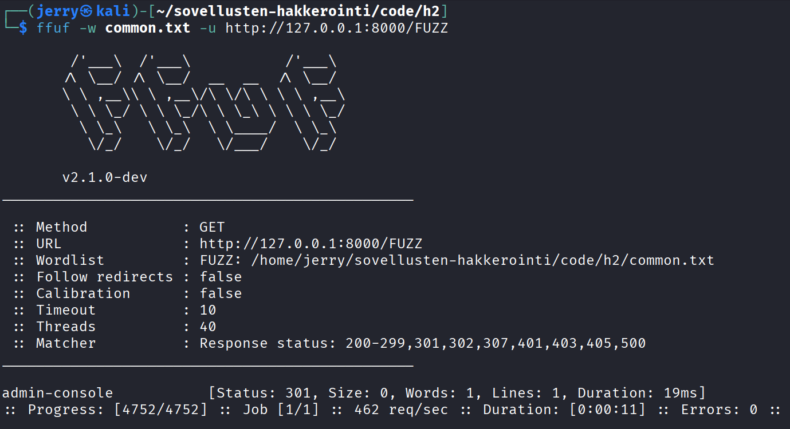

- Kokeilin vastausta **"admin-console"** selaimen URL-osoitteessa ja pääsin admin sivulle

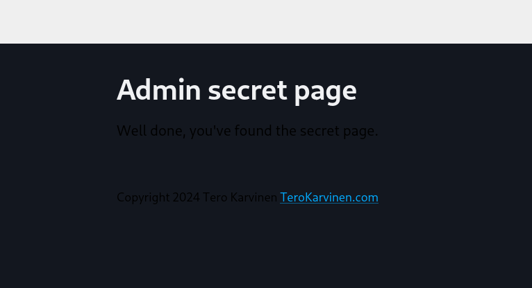

## e) Fix the 020-your-eyes-only vulnerability

- Lähdin tutkimaan sivun lähdekoodia ja löysin tiedostosta **/hats/views.py** kiinnostavan kohdan
- Tiedostossa oli kaksi osaa, jotka käsittelivät admin sivuja ja vain toisessa luki, että tarkistetaan käyttäjän oikeudet

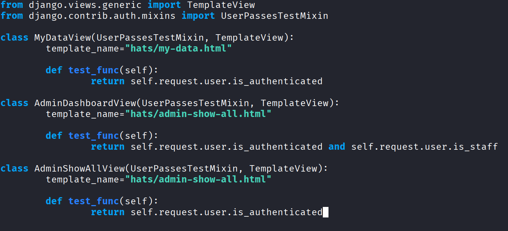

- Kopioin puuttuvan koodipätkän niin, että se on nyt molemmissa kohdissa sama

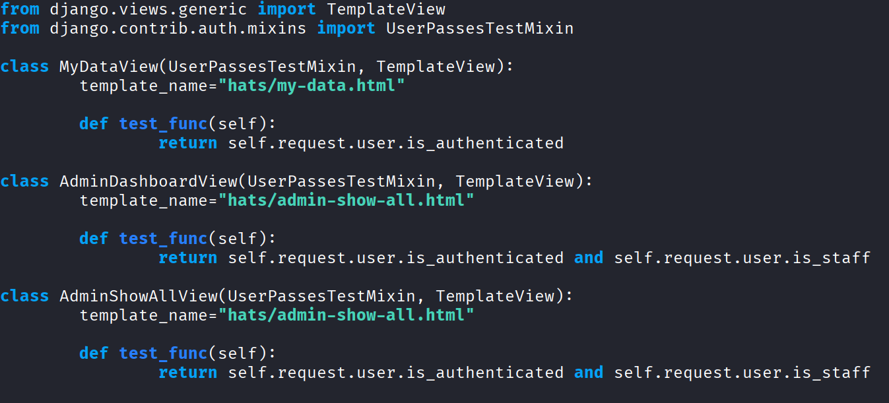

- Tämän jälkeen kirjauduin takaisin tililleni ja kokeilin kirjoittaa URL-osoitteeseen taas **admin-console** ja sain koodin **"403 forbidden"**, eli korjaus esti hyökkäyksen

## g) Introductory exercise that helps solve 010-staff-only

- Suoritin harjoituksen jo tunnin aikana

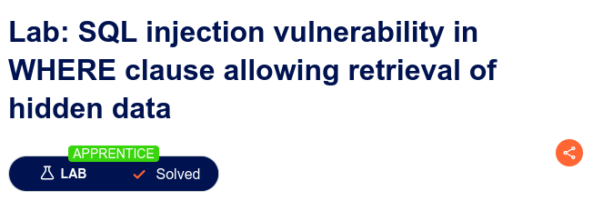

## Lähteet

- [A01 Broken Access Control](https://owasp.org/Top10/A01_2021-Broken_Access_Control/)
- [Find Hidden Web Directories - Fuzz URLs with ffuf](https://terokarvinen.com/2023/fuzz-urls-find-hidden-directories/)
- [Access control vulnerabilities and privilege escalation](https://portswigger.net/web-security/access-control)
- [Report Writing](https://terokarvinen.com/2006/raportin-kirjoittaminen-4/)
- [Hack'n Fix](https://terokarvinen.com/hack-n-fix/)
- [h2 - Break and Unbreak (solution)](https://askdatdude.github.io/school/answers/002-1.html)
- [ffuf - Debian Manpages](https://manpages.debian.org/testing/ffuf/ffuf.1.en.html)

