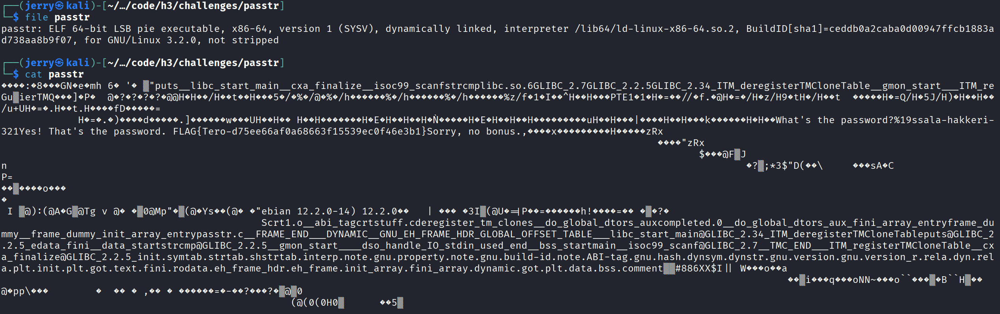
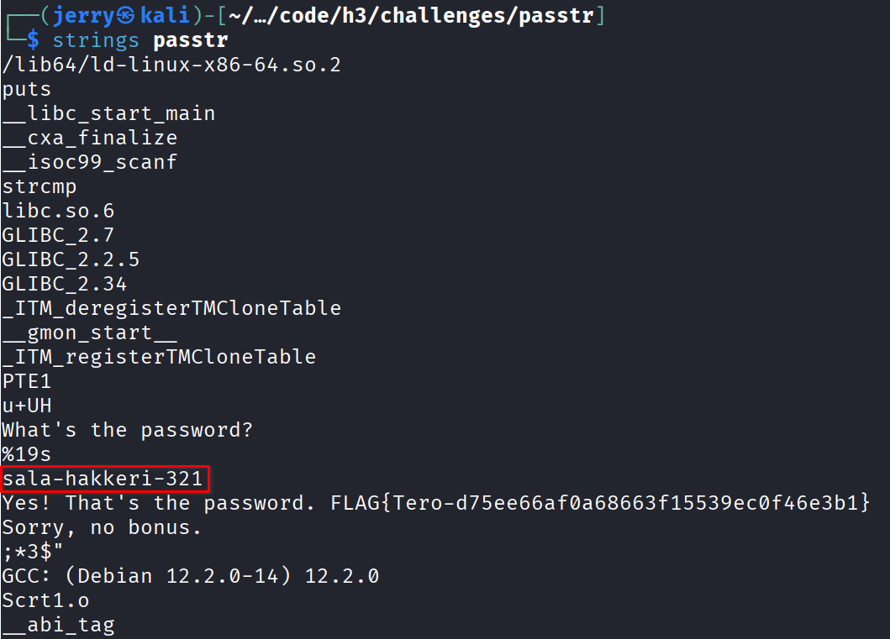
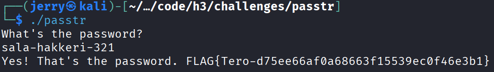
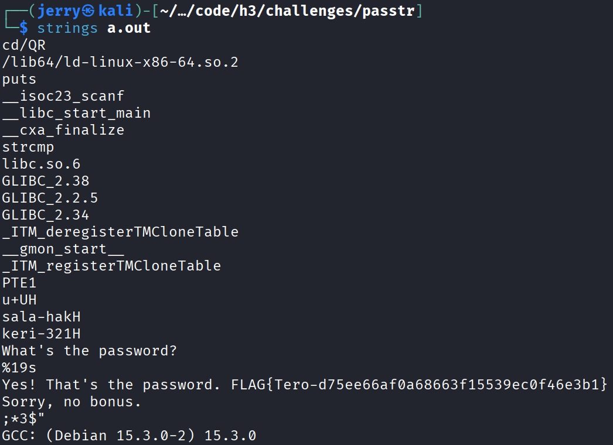
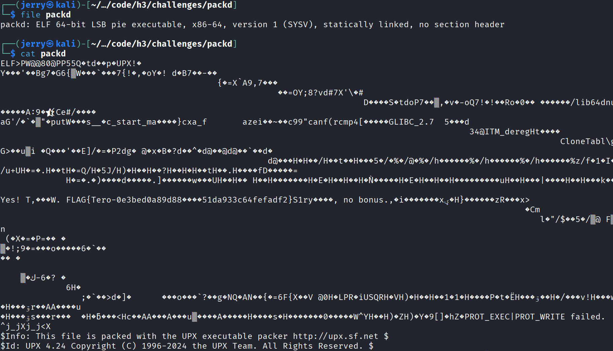
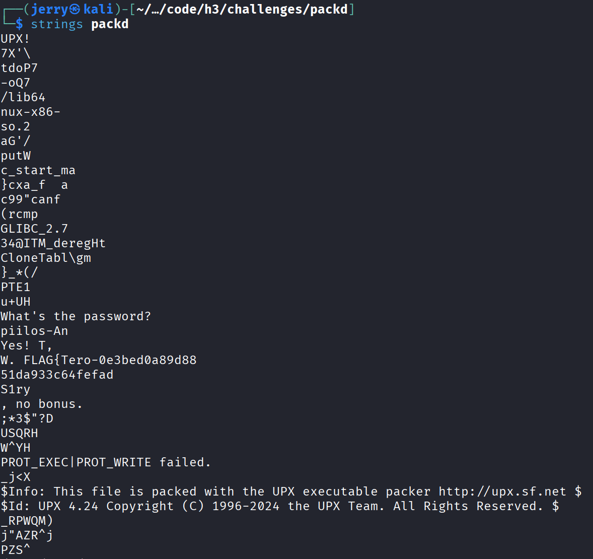
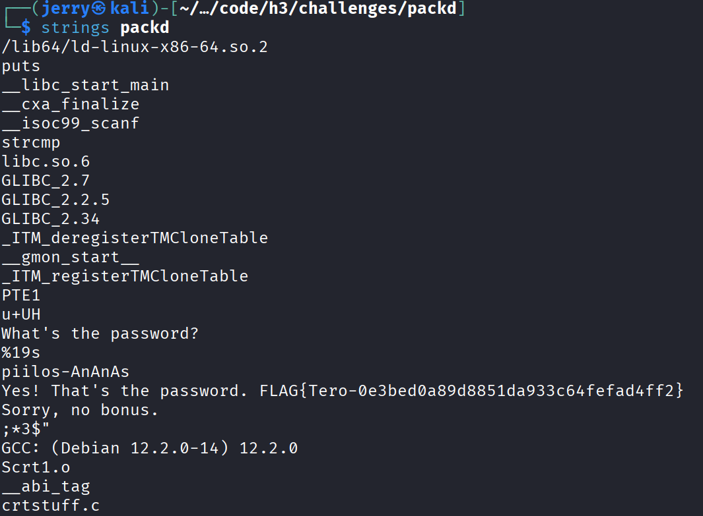
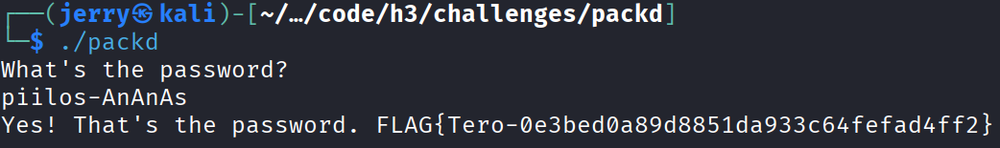

# H3 - No Strings Attached

## a) Strings

- Ensin latasin tiedoston **ezbin-challenges.zip**, purin sen ja ajoin ohjelman **passtr**

```bash
$ ./passtr
What's the password?
```
- Sitten aloin miettimään mistä salasana voisi löytyä
- Ensin kokeilin tarkastella ohjelmaa **cat** ja **file** komennoilla



- **file** komento kertoo millainen tiedosto on kyseessä, joka on aina hyödyllista ja **cat** komennon tulostus on sellaisessa muodossa, että siitä ei saa ihminen selvää
- Tämän jälkeen tutkin tiedostoa komennolla **strings**



- **strings** komento antoi paljon selkeämmän tulostuksen ja selaamalla hieman alas näin rivin, jossa luki **"sala-hakkeri-321"**, jonka oletan olevan salasana
- Kokeilin vielä käyttää salasanaa ohjelmassa ja se tosiaan oli oikea salasana
- Käyttämällä oikeaa salasanaa paljastuu myös lippu **FLAG{Tero-d75ee66af0a68663f15539ec0f46e3b1}**



## b) New version of passtr.c

- Tutkimalla **passtr.c** lähdekoodia huomasin, että salasana on koodissa yhtenä selvänä palana ja oletin, että se täytyy jotenkin rikkoa tai salata, jotta se ei löydy helposti
- Etsin netistä erilaisia esimerkkejä ja löysin joitakin koodipätkiä, jotka näyttivät lupaavalta, mutta en osannut soveltaa niitä
- Päätin kysyä AI:lta (ChatGPT) apua tehtävään
  - AI antoi koodipätkän, jossa näkyi samanlaisia osia kuin netissä löytämissäni koodeissa
  - ymmärsin koodista, että se ottaa salasanan ja pilkkoo sen osiin, jotta sitä ei voi suoraan löytää **strings** komennolla
 
```c
#include <stdio.h>
#include <string.h>

int main() {
    char password[20];

    /* Build the password at runtime instead of storing it as a string literal. /
    const unsigned char parts[] = {
        's', 'a', 'l', 'a', '-', 'h', 'a', 'k',
        'k', 'e', 'r', 'i', '-', '3', '2', '1', '\0'
    };

    printf("What's the password?\n");
    scanf("%19s", password);

    if (0 == strcmp(password, (const char)parts)) {
        printf("Yes! That's the password. FLAG{Tero-d75ee66af0a68663f15539ec0f46e3b1}\n");
    } else {
        printf("Sorry, no bonus.\n");
    }

    return 0;
} 
```

- Kokeilin tämän jälkeen tarkastella taas tiedostoa **strings** komennolla ja salasana oli hajautettu kahdelle riville ja hieman sekoitettu merkkejä



## c) Packd

- Lähestyin **packd** tiedostoa samalla tavalla kuin **passtr** tiedostoa tutkimalla sitä ensin **file** ja **cat** komennoilla
  - Näistä ei taaskaan ollut paljon apua salasanan löytämiseen, joka ei ollut yllätys



- Tämän jälkeen tutkin tiedostoa **strings** komennolla



- Tällä kertaa **strings** komento ei suoraan paljastanut salasanaa, mutta sain tärkeän tiedon, että tiedosto on pakattu **UPX** nimisellä ohjelmalla
- Latasin koneelleni **UPX** ohjelman, jotta voisin purkaa tiedoston pakkauksen
  - Selvitin **UPX:n** manuaalisivuilta, että tiedoston voi purkaa komennolla `upx -d`

```bash
$ sudo apt install upx
$ upx -d packd
```

- Tämän jälkeen katsoin tiedostoa taas **strings** komennolla ja näin rivin, jolla luki **"piilos-AnAnAs"** heti tehtävän lipun yläpuolella



- Kokeilin vielä, että salasana varmasti toimii



## Lähteet

