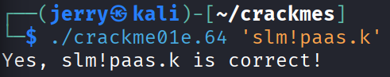
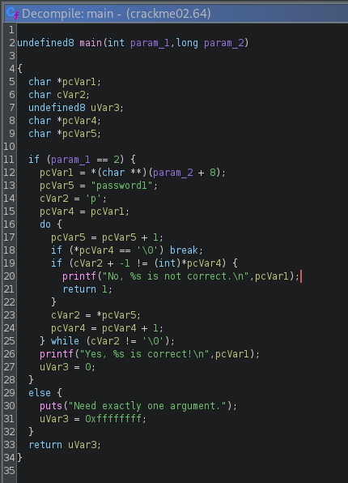
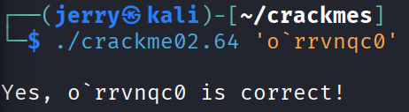

# H4 - Some Disassembly Required

## Tiivistelmät

### GHIDRA for Reverse Engineering (PicoCTF 2022 #42 'bbbloat')

- Videossa yritetään selvittää **bbbloat** nimisen ohjelman salainen numero, joka paljastaa lipun
- Ensin ohjelmaa tutkitaan työkaluilla **ltrace** ja **strace**, jos vastaus löytyisi helpoilla keinoilla
- Lopulta koodia tutkitaan **ghidran** sisällä ja löydetään hexadecimaalinumero, joka on oikea vastaus ja paljastaa lipun

## a) Install Ghidra

- Asensin **ghidran** Kali Linux virtuaalikoneelleni

```bash
$ sudo apt update && sudo apt install ghidra -y
```


## b) Rever-C

- Ensin loin uuden ghidra projektin nimeltä **packd_ghidra**
  - Lisäsin projektiin ohjelman **packd** ja avasin sen ghidrassa


- Löysin ghidran avulla kohdan, jossa luki isolla **"FUNCTION"** ja sen alla **"undefined main()"**
  - Oletin tämän olevan main ohjelma ja funktion sisällä oleva koodi näytti myös lupaavalta


- Koodissä näkyy, että **iVarl = strcmp(local_28, "piilos-AnAnAs");**
  - Tässä **strcmp**-funktio tarkistaa, että kaikki stringin **"piilos-AnAnAs"** merkit täsmäävät syötteessä **(local_28)**
  - Jos kaikki täsmää, funktio palauttaa **iVarl == 0** ja printtaa lippu
- Tästä voi päätellä, että **piilos-AnAnAs** on oikea salasana


## c) If backwards

- Ensin lisäsin aiemmin luomaani ghidra projektiin ohjelman **passtr** ja avasin sen ghidrassa
  - Etsin samalla tavalla kuin aiemmassa tehtävässä ohjelman main funktion


- Koodissa on sama kohta kuin aiemmassa ohjelmassa, missä tarkistetaan, että **iVarl == 0**
- Ghidran vasemmassa ikkunassa **iVarl == 0** on rivillä, jossa lukee TEST
    - Etsiessäni apua tehtävään löysin youtube videon (linkki lähteissä), jossa ratkaistaan samankaltaista tehtävää ja sain idean ratkaisuun
      - TEST rivin alla on kohta, jossa lukee **"JNZ"**, joka tarkoittaa **"jump if not zero"**, eli koodi hyppää **"Sorry, no bonus"** kohtaan, jos **iVarl** ei ole **0**
      - Vaihtamalla kohdan **"JNZ"**, niin, että siinä lukee **"JZ"**, eli **"jump if zero"** kääntää koodin ympäri niin, että se hyppää **"Sorry, no bonus"** kohtaan, jos **iVarl == 0**, eli oikein ja antaa lipun kaikista vääristä vastauksista

- Valitsin rivillä, jossa lukee **"JNZ"** **"patch instruction"** ja vaihdoin siihen **"JZ"**
  - Main funktion sisäinen koodi kääntyi oikealla tavalla ympäri


- Muutosten jälkeen painoin **"export the current function to C"** ja loin uuden tiedoston nimeltä **ghidra_passtr.c**
  - Yritin kääntää lähdekoodin ohjelmaksi nimeltä **ghidra_passtr**, mutta sain paljon virheilmoituksia

```bash
$ gcc ghidra_passtr.c ghidra_passtr
```


- Sain selväksi virheistä, että koodissa on joitain virheitä, sillä ghidra ei näytä täydellistä C koodia
  - Lähdin tutkimaan luomaani lähdekoodia korjatakseni virheet


- En osaa C koodia oikeastaan yhtään, joten kysyin Tekoälyltä (ChatGPT) ohjeita muokkauksiin


- Tein tekoälyn ehdottamat muutokset ja koodi näytti heti selkeämmältä


- Kokeilin uudestaan kääntää lähdekoodin

```bash
$ gcc ghidra_passtr.c ghidra_passtr
```

- Tällä kertaa käännös onnistui
- Seuraavaksi kokeilin toimiiko ohjelma nyt väärillä salasanoilla


## d) Nora CrackMe

- Latasin tiedostot GitHubista

```bash
$ git clone https://github.com/NoraCodes/crackmes.git
```

- Varmistin myös, että minulla on tarvittavat ohjelmat

```bash
$ sudo apt install build-essential gcc xxd binutils
```

## e) Nora crackme01

- Ensin käänsin lähdekoodista ohjelman **README.md** ohjeilla

```bash
$ make crackme01
```

- Tämän jälkeen lisäsin ohjelman ghidra projektiin, avasin sen ghidrassa ja löysin main funktion


- Koodista näkyy, että oikea salasana on **"password1"**


## e) Nora crackme01e

- Käänsin lähdekoodista taas ohjelman ja avasin sen samalla tavalla ghidrassa


- Koodi oli hyvin samanlainen edelliseen tehtävään verrattuna ja sain selville, että oikea salasana on **"slm!paas.k"**
- Kokeiltuani salasanaa sain virheilmoituksen


- Ilmoituksessa luki **"zsh"**, eli tiesin ongelman liittyvän käyttämääni **shelliin** eikä koodiin
  - Etsin vastausta netistä ja sain selville, että stringi täytyy olla **''** merkkien sisällä



## f) Nora crackme02

- Käänsin lähdekoodin ohjelmaksi samalla tavalla kuin aiemmin, avasin sen ghidrassa ja löysin main funktion



- En osaa C koodia tarpeeksi, että olisin keksinyt kaikkien muuttujien nimet, joten käytin tekoälyä apuna
  - Main funktion muuttujien uudet nimet voisivat olla:
    - **param_1** = argc
    - **param_2** = argv
    - **pcVar1** = input
    - **pcVar4** = compare_ptr
    - **pcVar5** = input_ptr
    - **cVar2** = password_ptr
    - **uVar3** = return_code

- Ohjelma toimii niin, että se ottaa salasanan **"password1"** ja lisää jokaisen merkin **ascii** koodiin **+1**
  - Ohjelma ottaa käyttäjän antaman salasanan ja **miinustaa** jokaisesta merkista yhden ascii merkin alaspäin ja tarkistaa tuleeko siitä **"password1"**
  - Eli oikea vastaus on **"o`rrvnqc0"**



## Lähteet

- [Terokarvinen.com](https://terokarvinen.com/)
- [Patching Binaries with Ghidra](https://www.youtube.com/watch?v=8U6JOQnOOkg)
- [An Intro to x86_64 Reverse Engineering](https://nora.codes/tutorial/an-intro-to-x86_64-reverse-engineering/)
- [ChatGPT käytetty koodivirheisiin, muuttujien nimiin ja kirjoitusvirheiden tarkistamiseen](https://chatgpt.com/)
