# H4 - Some Disassembly Required

## Tiivistelmät

### GHIDRA for Reverse Engineering (PicoCTF 2022 #42 'bbbloat')

- Videossa yritetään selvittää bbbloat nimisen ohjelman salainen numero, joka paljastaa lipun
- Ensin ohjelmaa tutkitaan työkaluilla **ltrace** ja **strace**, jos vastaus löytyisi helpoilla keinoilla
- Lopulta koodia tutkitaan **ghidran** sisällä ja löydetään hexadecimaalinumero, joka on oikea vastaus ja paljastaa lipun

## a) Install Ghidra

- Asensin **ghidran** Kali Linux virtuaalikoneelleni

```bash
$ sudo apt update && sudo apt install ghidra -y
```

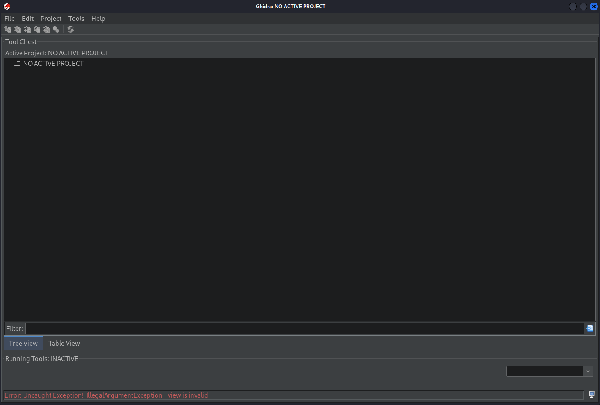

## b) Rever-C

- Ensin loin uuden ghidra projektin nimeltä **packd_ghidra**
  - Lisäsin projektiin ohjelman **packd** ja avasin sen ghidrassa

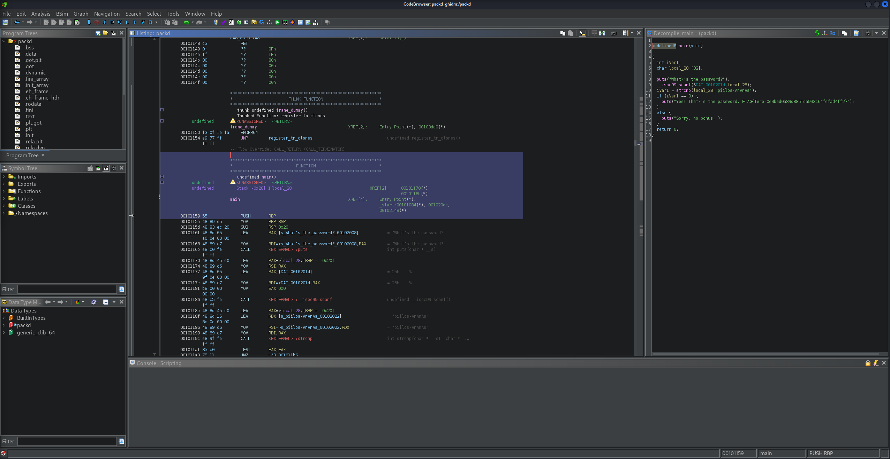

- Löysin ghidran avulla kohdan, jossa luki isolla **FUNCTION** ja sen alla **"undefined main()"**
  - Oletin tämän olevan main ohjelma ja funktion sisällä oleva koodi näytti myös lupaavalta

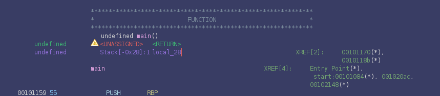
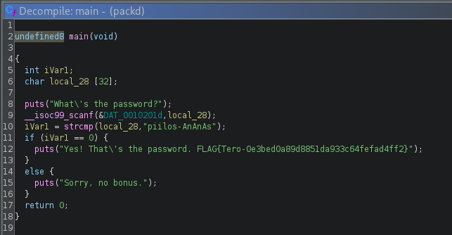

- Koodissä näkyy, että stringi **"piilos-AnAnAs"** on muuttuja **iVarl**
  - Sen alla näkyy tarkistus sille, että **iVarl == 0** ja jos tämä toteutuu printtaa lippu
- Tästä voi päätellä, että piilos-AnAnAs on oikea salasana

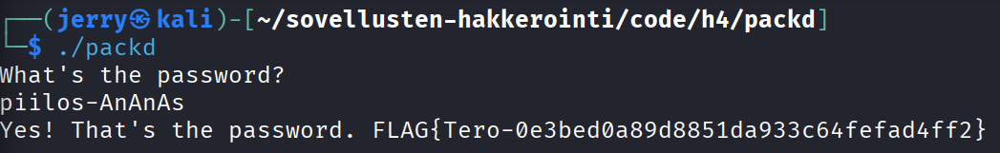

## c) If backwards

- Ensin lisäsin aiemmin luomaani ghidra projektiin ohjelman **passtr** ja avasin sen ghidrassa
  - Etsin samalla tavalla kuin aiemmassa tehtävässä ohjelman main funktion

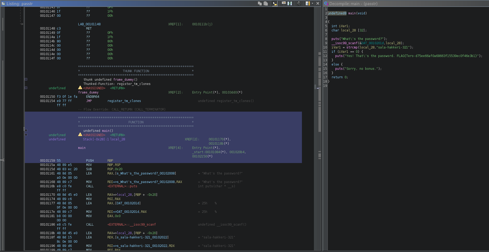

- Koodissa on sama kohta kuin aiemmassa ohjelmassa, missä tarkistetaan, että **iVarl == 0**
  - Ghidran vasemmassa ikkunassa **iVarl == 0** on rivillä, jossa lukee TEST
    - Tämän rivin alla on kohta, jossa lukee JNZ, joka tarkoittaa **jump if not zero**, eli koodi hyppää "Sorry, no bonus" kohtaan, jos iVarl ei ole sama kuin 0
    - Vaihtamalla kohdan "JNZ", niin, että siinä lukee "JZ", eli "jump if zero" kääntää koodin ympäri niin, että se hyppää "Sorry, no bonus" kohtaan, jos iVarl == 0, eli oikein ja antaa lipun kaikista vääristä vastauksista

- Valitsin rivillä, jossa lukee JNZ "patch instruction" ja vaihdoin siihen JZ
  - Main funktion sisäinen koodi kääntyi oikealla tavalla ympäri

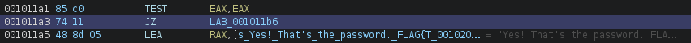
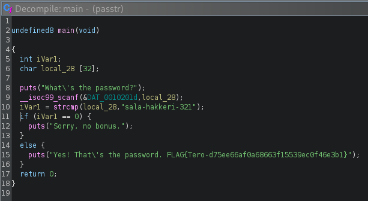

- Muutosten jälkeen painoin "export the current function to c" ja loin uuden tiedoston nimeltä **ghidra_passtr.c**
  - Yritin kääntää lähdekoodin ohjelmaksi nimeltä **ghidra_passtr**, mutta sain paljon virheilmoituksia

```bash
$ gcc ghidra_passtr.c ghidra_passtr
```

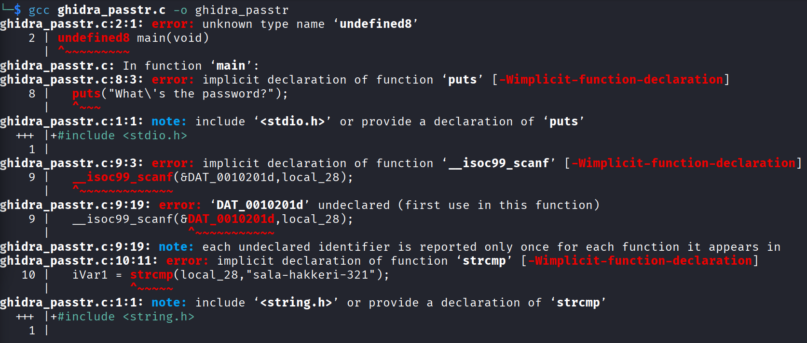

- Sain selväksi virheistä, että koodissa on joitain virheitä, sillä ghidra ei näytä täydellistä C koodia
  - Lähdin tutkimaan luomaani lähdekoodia korjatakseni virheet

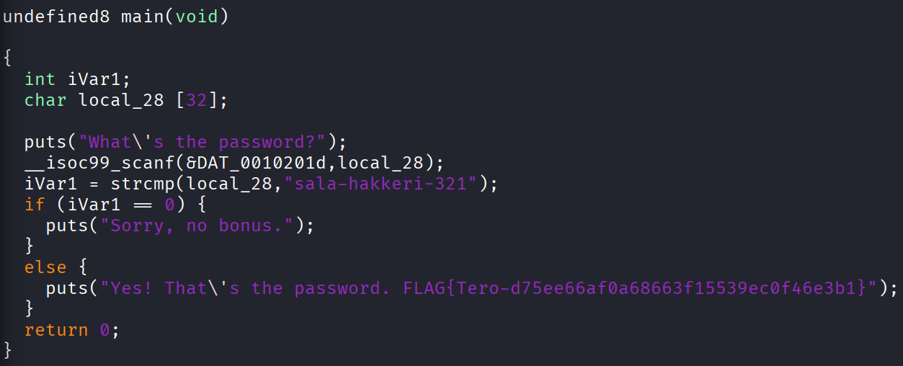

- En osaa C koodia oikeastaan yhtään, joten kysyin Tekoälyltä ohjeita muokkauksiin

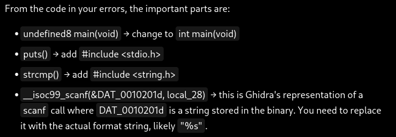

- Tein tekoälyn ehdottamat muutokset ja koodi näytti heti selkeämmältä

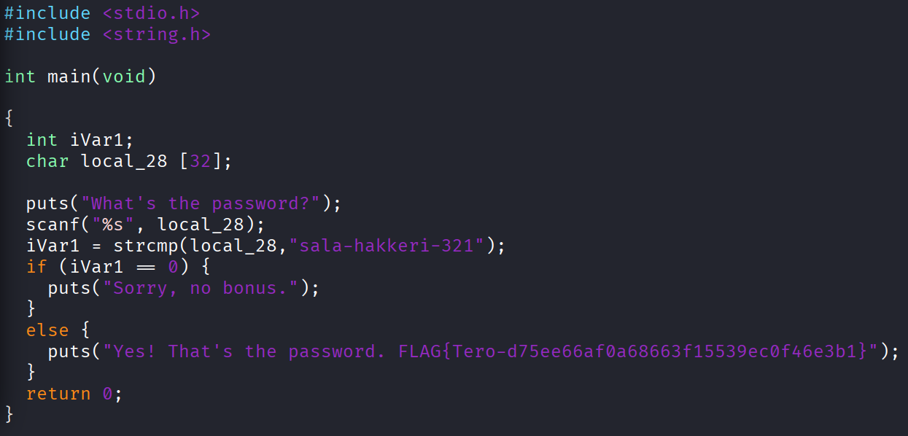

- Kokeilin uudestaan kääntää lähdekoodin

```bash
$ gcc ghidra_passtr.c ghidra_passtr
```

- Tällä kertaa käännös onnistui
- Seuraavaksi kokeilin toimiiko ohjelma nyt väärillä salasanoilla

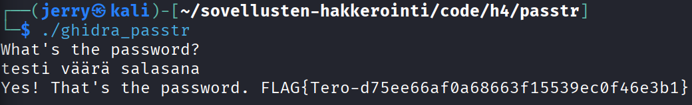

## d) Nora CrackMe

- Latasin tiedostot GitHubista

```bash
$ git clone https://github.com/NoraCodes/crackmes.git
```

- Varmistin myös, että minulla on tarvittavat ohjelmat

```bash
$ sudo apt install build-essential gcc xxd binutils
```

## e) Nora crackme01

- Ensin käänsin lähdekoodista ohjelman README.md ohjeilla

```bash
$ make crackme01
```

- Tämän jälkeen lisäsin ohjelman ghidra projektiin, avasin sen ghidrassa ja löysin main funktion

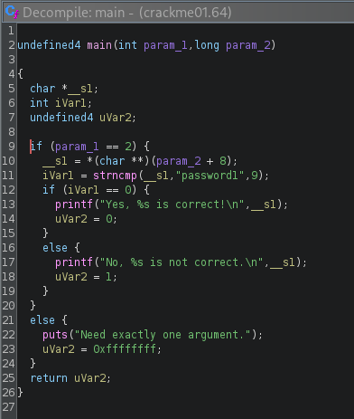

- Koodista näkyy, että oikea stringi on "password1"

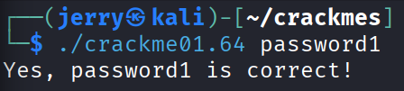

## f) Nora crackme01e

- Käänsin lähdekoodista taas ohjelman ja avasin sen samalla tavalla ghidrassa

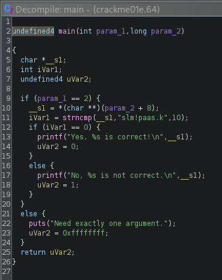

- Koodi oli hyvin samanlainen edelliseen tehtävään verrattuna ja sain selville, että oikea stringi on "slm!paas.k"
- Kokeiltuani salasanaa sain virheilmoituksen

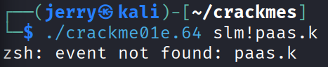

- Ilmoituksessa luki "zsh", eli tiesin ongelman liittyvän käyttämääni shelliin eikä koodiin
  - Etsin vastausta netistä ja sain selville, että stringi täytyy olla '' merkkien sisällä


## Lähteet

- [A01 Broken Access Control](https://owasp.org/Top10/A01_2021-Broken_Access_Control/)
