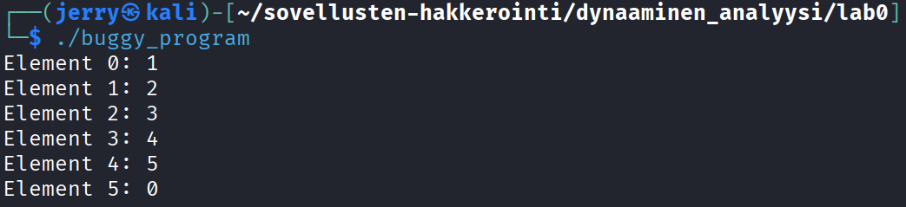
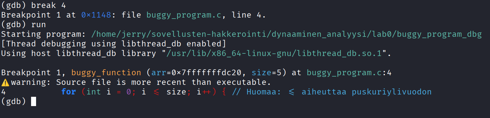
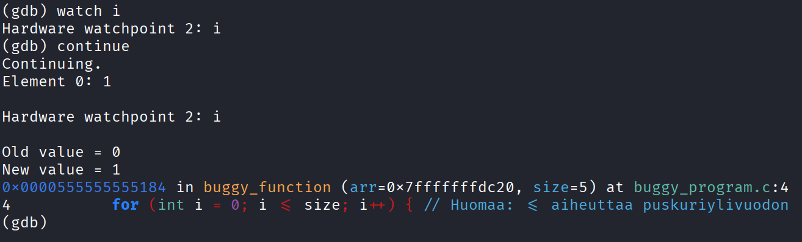
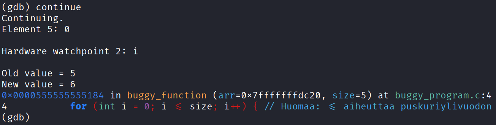
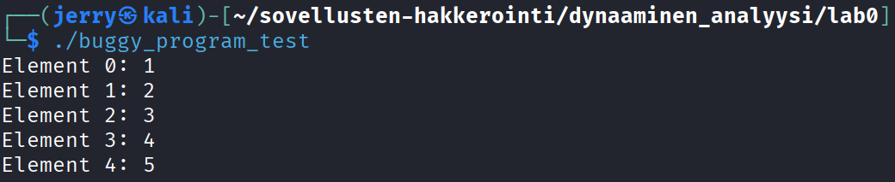

# H5 - Binääri tässä, missä koodit?

## Lab0

- Ensimmäisenä latasit kansion Moodlesta ja purin kaikki tarvittavat Lab -tiedostot
- Sitten ajoin Lab0 sisällä olevan **buggy_program** -ohjelman



- Ohjelman tarkoitus on ilmeisesti tulostaa tietty määrä numeroita ja niille jonkinlainen ID
- Tulostuksen perusteella numeroita tulisi olla 5, koska se oudosti hyppää nollaan viiden numeron jälkeen
  - Päätin tutkia tarkemmin ohjelmaa lähdekoodin avulla

```c
#include <stdio.h>

void buggy_function(int *arr, int size) {
    for (int i = 0; i <= size; i++) { // Huomaa: <= aiheuttaa puskuriylivuodon
        printf("Element %d: %d\n", i, arr[i]);
    }
}

int main() {
    int numbers[] = {1, 2, 3, 4, 5};
    buggy_function(numbers, 5); // Virheellinen koko
    return 0;
}
```

- Lähdekoodista näkee, että ohjelma printtaa **numbers** nimisestä taulukosta numerot ja niille Element numeron
  - Numero joka printataan perustuu muuttujan **i** arvoon, koska **printf** komennon sisällä näkyy **arr[i]**
- Lähdekoodista näin myös kommenteissa olevat virheet, mutta en ihan tiennyt mitä ne tarkoittaa vielä
- Lähdin siis tutkimaan ohjelmaa **gdb** -ohjelmalla



- Laitoin ensimmäisenä **break pointin** riville 4, jossa kommentin mukaan oli ensimmäinen virhe
- Kun ajoin ohjelmaa eteenpäin **run** komennolla näin ainakin, että buggy_function koko on **5**
  - Alemmassa kommentissa luki, että 5 on virheellinen koko
- Koodin alussa näkyy myös, että **i <= size**, joten oletin muuttujien **i** ja **size** olevan oleellisia tutkia



- Loin **watchpointin**, jolla voin seurata muuttujan **i** arvoa
  - Ensin se muuttui arvosta 1 arvoon 2
  - Päätin jatkaa seuraamista käyttämällä komentoa **continue** uudestaan ja uudestaan
  - Jatkettuani kokonaiset viisi kertaa huomasin, että muuttujan **i** arvo nousi yli viiteen



- Muistin nähneeni koodissa pätkän **i <= size** ja sain selville, että **size=5**
- Mietin miten tämän korjaisi ja ajattelin, että jos muuttujan **i** arvon pitää alle 5, niin ei pitäisi käydä näin
  - Joten muutin koodista kohdan **i <= size** niin, että **i < size**

```c
#include <stdio.h>

void buggy_function(int *arr, int size) {
    for (int i = 0; i < size; i++) { // Huomaa: <= aiheuttaa puskuriylivuodon
        printf("Element %d: %d\n", i, arr[i]);
    }
}

int main() {
    int numbers[] = {1, 2, 3, 4, 5};
    buggy_function(numbers, 5); // Virheellinen koko
    return 0;
}
```

- Käänsin muokatusta lähdekoodista uuden ohjelman ja kokeilin ajaa sen



- Nyt tulostus näyttää paljon paremmalta ja extra riviä numeron 5 jälkeen ei enää ole

## Lab1


