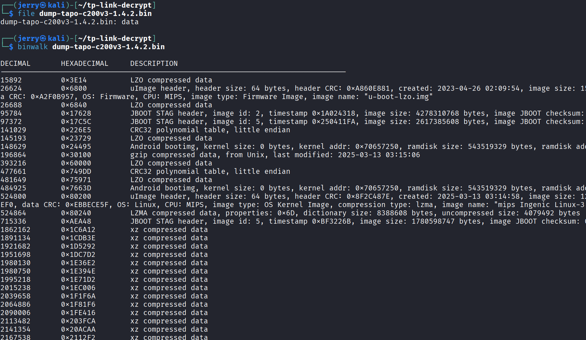
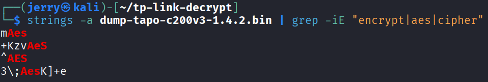
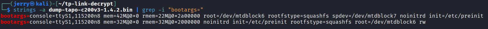
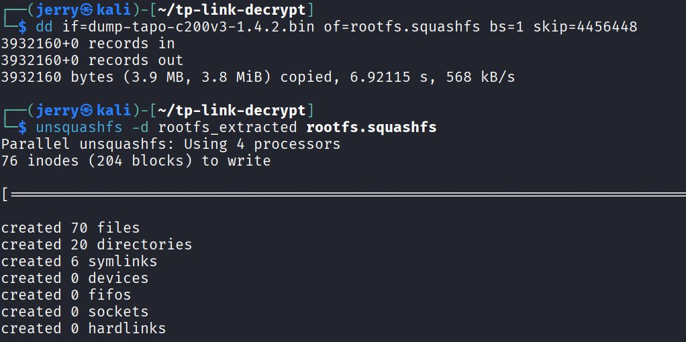
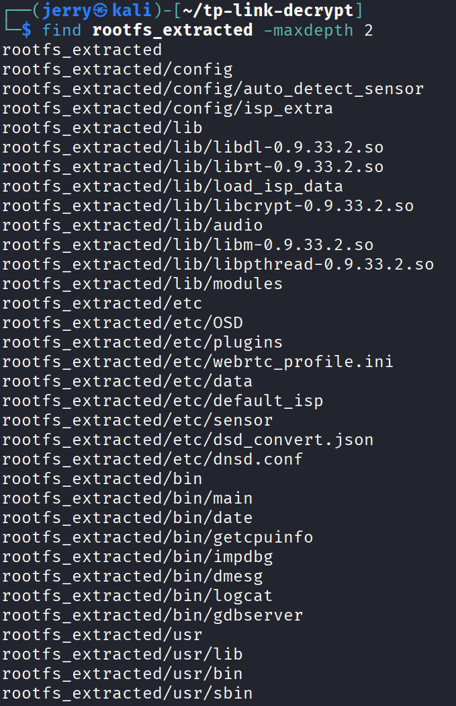
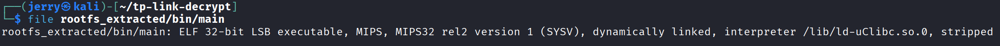
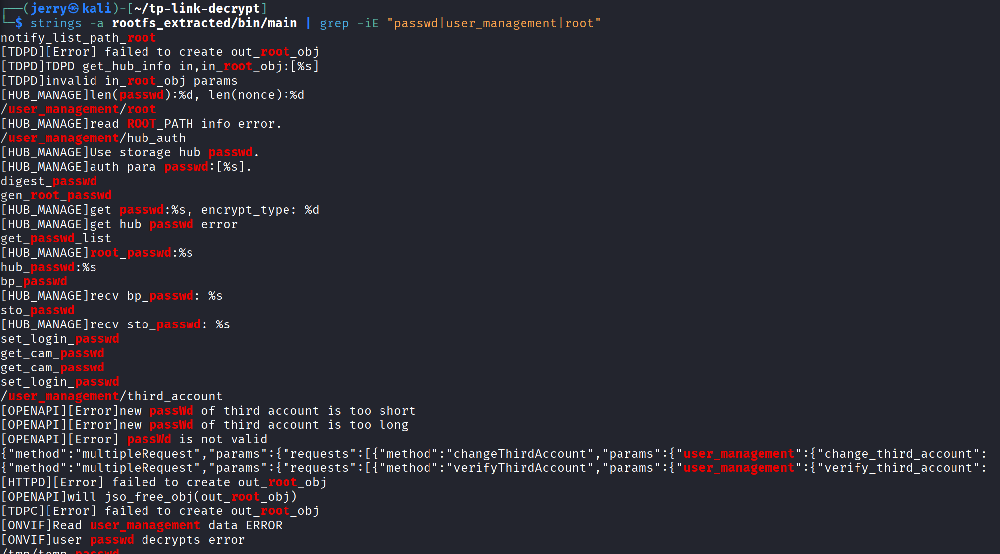

# H6 - Onkohan tämä turvallinen käyttää?

- Ensimmäisenä latasin tarvittavat tiedostot, eli githubista **tp-link-decrypt** repon ja **dump -tiedoston** Moodlesta
  - Ladattuani **tp-link-decrypt** repon noudatin README.md ohjeita ja ajoin tarvittavat skriptit
- Sitten aloin tutkimaan dump -tiedostoa **file** ja **binwalk** -komennoilla

- Tämän jälkeen tutkin tiedostoa **strings** -komennolla

- Yritin **grepin** avulla etsiä erilaisia merkkijonoja, mutta löydöt eivät auttaneet
- Sitten kokeilin samaa komentoa, mutta etsien **"bootargs="** merkkijonoja löytääkseen miten tiedosto käynnistyy

- Tulostuksesta löytyi kaksi eri riviä joissa kummassakin oli kiinnostava **rootfstype=squashfs**
- Käytin **dd** komentoa leikkaamaan **rootfs.squashfs** -kohdan tiedostosta ja purin sen hakemistopuuksi, jotta sitä voi tutkia normaaleilla työkaluilla

- Seuraavaksi tutkin hakemistoa **find** -komennolla

- Suodatin **find** -komentoa vielä enemmän tutkimaan tiedostoa **rootfs_extracted/bin/main**

- Saadaan selville, että tiedosto on **ELF-binääriä**
- Tutkin tiedostoa **strings** -komennolla löytääkseni rivejä joissa mainittaisiin jotain salasanaan liittyvää

- Tulostuksesta ei valitettavasti löydy salasanaa ja ilmeisesti sitä ei ole tallennettu staattisena vaan se generoidaan. Tästä eteenpäin en enää tiennyt miten jatkaisin ja tuntui, että osuin seinään.
- Uskon, että varmasti on haavoittuvuuksia näissä tiedostoissa, mutta en vain osaa omalla osaamisellani arvioida niitä tai kuinka isoja haavoittuvuuksia ne oikeasti olisi.

## Lähteet

- [Terokarvinen.com](https://terokarvinen.com/)
- [Claude käytetty auttamaan komentojen kanssa](https://claude.ai)
- [tp-link-decrypt](https://github.com/robbins/tp-link-decrypt)
- [Rooting the TP-Link Tapo C200 Rev.5](https://quentinkaiser.be/security/2025/07/25/rooting-tapo-c200/)
